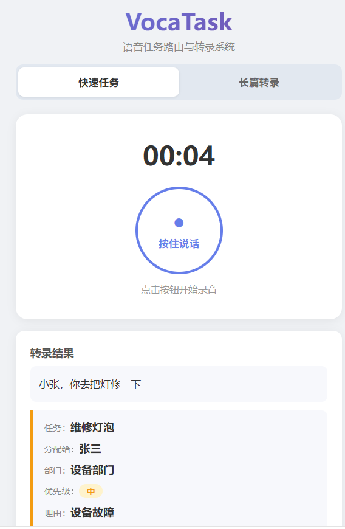
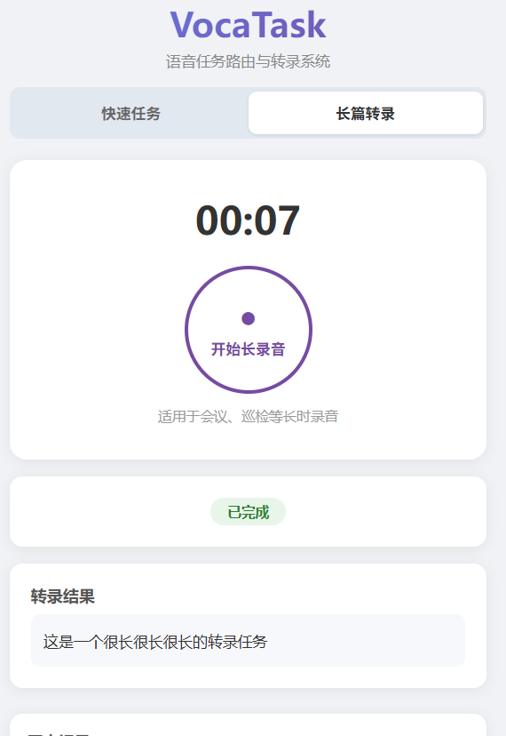

# VocaTask — Timeline Estimate

> All estimates based on AI-assisted development (Claude Code).

---

## PoC Screenshots

<table>
<tr>
<td> <b>Quick Task / 快速任务</b></td>
<td> <b>Long Transcription / 长篇转录</b></td>
</tr>
</table>

---

## Current Status

| Module | Status |
|--------|--------|
| Voice recording + upload | Done |
| ASR transcription (ZhipuAI GLM-ASR-2512) | Done |
| Task routing (GLM-4-flash function calling + keyword fallback) | Done |
| Long-form transcription queue (background worker + ffmpeg segmentation) | Done |
| Browser UI (recording, results display, status polling) | Done |
| Mock org data (10 people, 5 departments, hardcoded) | Done |

---

## PoC Timeline

### Option 1: Browser Only — Already Functional + 2-4 Hours Polish

The core task delegation pipeline is already working. Only minor polish needed before demo.

| Task | Time |
|------|------|
| Save routed tasks to a simple list (in-memory or SQLite, no full CRM) | 1h |
| Add task history view in UI (list of past routed tasks) | 1h |
| Test with real voice input in browser, fix any issues | 1-2h |

Test on real phone: open `http://<server-ip>:8010` in phone browser, use microphone — works immediately, no installation needed.

### Option 2: Deploy to Cloud + Real Device Testing — 2-3 Days

Take the working prototype, deploy to a cloud server, and test on real phones over 4G/5G.

| Task | Time |
|------|------|
| Polish tasks (same as Option 1) | 2-4h |
| Provision cloud server (Alibaba Cloud / Tencent Cloud) | 1h |
| Deploy backend to cloud + configure nginx | 2h |
| HTTPS setup (Let's Encrypt) | 30min |
| Replace mock org data with real employee list | 1h |
| Test on real Android phone over 4G/5G | 1h |
| Test on real iPhone over 4G/5G | 1h |
| Fix mobile-specific issues (mic permission, browser compat, audio format) | 2-4h |
| Bug fixes and stability testing | 2-3h |

### Option 3: React Native App on Real Device — 4-6 Days

Wrap the prototype in a native mobile app and install on a real phone.

| Task | Time |
|------|------|
| All tasks from Option 2 (deploy backend) | 1 day |
| React Native project setup + voice recording module | 1-2 days |
| API integration (connect app to deployed backend) | 1 day |
| Test on real Android device (USB debug) | 2-3h |
| Test on real iPhone (TestFlight) | 2-3h |
| Fix device-specific issues (permissions, audio codecs, background recording) | 1-2 days |

### PoC Deliverables

- Working app: record voice → AI transcribes → routes to person/department → shows result
- Long-form recording → queued → transcribed → stored
- Task history: list of all routed tasks
- Employee list with responsibilities driving AI routing
- Tested on real mobile device

### What's NOT in PoC (deferred to later)

- CRM management UI (departments/people CRUD)
- User authentication
- Database migration (SQLite → PostgreSQL)
- Notifications
- Photo attachments
- Offline mode
- Push notifications

### How Task Delegation Works

The system uses an employee list with responsibilities to match tasks to the right person:

1. **Employee list** defined in `core/org_structure.py` — each person has name, department, title, and responsibilities
2. **Voice input** → ASR transcribes → text sent to GLM-4-flash
3. **AI routing** — GLM receives the org structure as context, uses function calling to pick the best assignee based on task content and employee responsibilities
4. **Fallback** — if AI unavailable, keyword matching against responsibilities (e.g. "equipment" → equipment department)
5. **Result** — task description + assigned person + department + priority + reason displayed in UI

**To customize for client**: replace the mock data in `core/org_structure.py` with real employee names and responsibilities. No code changes needed, just data.

---

## Production Timeline

### Mobile App: Browser vs. Native

| | Browser (Current) | React Native App |
|--|-------------------|------------------|
| Access | Open URL in phone browser | Install from App Store / Google Play |
| Voice recording | Web MediaRecorder API | Native microphone access |
| Push notifications | No | Yes (Firebase / APNs) |
| Offline support | Limited | Full (local queue + sync) |
| Development time | Already done | +1-2 weeks |
| App Store review | Not needed | 3-7 days review time |
| **Recommendation** | Start here for PoC and early production | Add later when confirmed needed |

**Mobile deployment timeline:**

| Task | Time |
|------|------|
| React Native project setup + voice recording module | 2-3 days |
| API integration (connect to existing backend) | 1-2 days |
| Offline queue (record without network, sync later) | 1-2 days |
| Push notification setup (Firebase for Android, APNs for iOS) | 1 day |
| Testing on real devices (Android + iOS) | 1-2 days |
| App Store / Google Play submission and review | 3-7 days (waiting) |
| **Total** | **+1-2 weeks active dev + 1 week review** |

### Deployment: Cloud Server vs. On-Premise

| | Cloud Server | Company Intranet |
|--|-------------|-----------------|
| Setup time | 1 day | 3-5 days |
| External access (4G/5G) | Built-in | Requires VPN or reverse proxy |
| SSL/HTTPS | Free (Let's Encrypt) | Self-signed cert or internal CA |
| Firewall config | Minimal | Coordinate with IT department |
| Database | Managed PostgreSQL available | Install and maintain ourselves |
| Maintenance | Cloud provider handles hardware | Client's IT handles hardware |
| Cost | ~100-200 CNY/month | No monthly cost (existing hardware) |
| Data sovereignty | Data leaves company network | Data stays on-site |

**Cloud server deployment: 1 day**

| Task | Time |
|------|------|
| Provision server (Alibaba Cloud / Tencent Cloud) | 1h |
| Install Python, PostgreSQL, nginx | 1-2h |
| Deploy backend code, configure systemd service | 1h |
| HTTPS setup (Let's Encrypt) | 30min |
| DNS configuration | 30min |
| Smoke test + verify from mobile | 1h |

**On-premise deployment: 3-5 days**

| Task | Time |
|------|------|
| Coordinate with client IT (server access, OS, network) | 1 day |
| Install Python, PostgreSQL, nginx on internal server | 1 day |
| Firewall / port configuration for mobile access | 1 day |
| VPN or reverse proxy setup (for 4G/5G access from field) | 1-2 days |
| Internal SSL cert or self-signed | 1h |
| Smoke test from inside and outside network | 1h |

### Full Production Timeline (by Scenario)

**Scenario A: Cloud Server + Browser Access**

| Phase | Time | Tasks |
|-------|------|-------|
| Week 1 | 5 days | Backend hardening, error handling, audio format compatibility |
| Week 2 | 5 days | Task lifecycle, auth, notifications, task dashboard |
| Week 3 | 3-5 days | Cloud deploy, PostgreSQL migration, testing |
| Week 4 (optional) | 5 days | CRM integration, photo attachments |
| **Total** | **3-4 weeks** | |

**Scenario B: Cloud Server + React Native App**

| Phase | Time | Tasks |
|-------|------|-------|
| Weeks 1-3 | Same as Scenario A | Backend + deploy |
| Week 4 | 5 days | React Native app development |
| Week 5 | 5 days | Offline queue, push notifications, device testing |
| Week 6 | 3-7 days | App Store / Google Play review (waiting) |
| **Total** | **4-5 weeks + review** | |

**Scenario C: On-Premise + Browser Access**

| Phase | Time | Tasks |
|-------|------|-------|
| Weeks 1-2 | Same as Scenario A | Backend development |
| Week 3 | 3-5 days | On-premise deployment + IT coordination |
| Week 4 (optional) | 5 days | CRM integration, photo attachments |
| **Total** | **3-4 weeks** | (but may slip if IT coordination slow) |

**Scenario D: On-Premise + React Native App**

| Phase | Time | Tasks |
|-------|------|-------|
| Weeks 1-2 | Same as Scenario A | Backend development |
| Week 3 | 3-5 days | On-premise deployment |
| Week 4-5 | 10 days | React Native app + offline + push |
| Week 6 | 3-7 days | App Store review |
| **Total** | **5-6 weeks + review** | |

---

## Summary

| Phase | Time | What You Get |
|-------|------|-------------|
| **PoC 1** (browser only) | Done + 2-4h polish | Working demo in browser |
| **PoC 2** (cloud + real device) | 2-3 days | Deployed, tested on real phone via browser |
| **PoC 3** (native app on device) | 4-6 days | Native app installed on real phone |
| **Production A** (cloud + browser) | 3-4 weeks | Deployed cloud system, auth, notifications |
| **Production B** (cloud + app) | 4-5 weeks + review | Same as A + native mobile app |
| **Production C** (on-premise + browser) | 3-4 weeks | Deployed on internal server |
| **Production D** (on-premise + app) | 5-6 weeks + review | Same as C + native mobile app |

**Recommendation**: PoC 2 for fastest real-device validation. Production A for fastest go-live.

---

---

# VocaTask — 时间评估

> 所有时间估算基于 AI 辅助开发（Claude Code）。

---

## 当前进度

| 模块 | 状态 |
|------|------|
| 语音录制 + 上传 | 已完成 |
| ASR 转录（智谱 GLM-ASR-2512） | 已完成 |
| 任务路由（GLM-4-flash 函数调用 + 关键词 fallback） | 已完成 |
| 长篇转录队列（后台 Worker + ffmpeg 分片） | 已完成 |
| 浏览器 UI（录音、结果展示、状态轮询） | 已完成 |
| 模拟组织数据（10 人、5 部门，硬编码） | 已完成 |

---

## PoC 时间

### 方案一：仅浏览器 — 已完成 + 2-4 小时打磨

任务委派核心流程已经跑通，只需微调即可用于演示。

| 任务 | 时间 |
|------|------|
| 将路由结果保存为简单列表（内存或 SQLite，不做完整 CRM） | 1h |
| 添加任务历史记录界面（展示过去路由过的任务） | 1h |
| 用真实语音输入测试，修复问题 | 1-2h |

手机测试：手机浏览器打开 `http://<服务器IP>:8010`，使用麦克风 — 无需安装，立即可用。

### 方案二：部署到云端 + 真机测试 — 2-3 天

把跑通的原型部署到云服务器，用真手机在 4G/5G 下测试。

| 任务 | 时间 |
|------|------|
| 打磨任务（同方案一） | 2-4h |
| 购买云服务器（阿里云/腾讯云） | 1h |
| 部署后端到云 + 配置 nginx | 2h |
| HTTPS 配置（Let's Encrypt） | 30min |
| 将模拟数据替换为真实员工列表 | 1h |
| Android 真机 4G/5G 测试 | 1h |
| iPhone 真机 4G/5G 测试 | 1h |
| 修复移动端问题（麦克风权限、浏览器兼容、音频格式） | 2-4h |
| Bug 修复 + 稳定性测试 | 2-3h |

### 方案三：React Native App 真机安装 — 4-6 天

把原型包装成原生 App，安装到真机上。

| 任务 | 时间 |
|------|------|
| 方案二全部任务（部署后端） | 1 天 |
| React Native 项目搭建 + 语音录制模块 | 1-2 天 |
| API 对接（App 连接已部署的后端） | 1 天 |
| Android 真机测试（USB 调试） | 2-3h |
| iPhone 真机测试（TestFlight） | 2-3h |
| 修复设备问题（权限、音频编解码、后台录音） | 1-2 天 |

### PoC 交付物

- 可运行应用：录音 → AI 转录 → 路由到人员/部门 → 展示结果
- 长篇录音 → 排队 → 转录 → 存储
- 任务历史记录列表
- 员工职责列表驱动 AI 路由
- 真机上测试通过

### PoC 不包含（后续再做）

- CRM 管理界面（部门/人员增删改查）
- 用户认证
- 数据库迁移（SQLite → PostgreSQL）
- 通知推送
- 照片附件
- 离线模式
- 推送通知

### 任务委派逻辑

系统通过员工及其职责列表来智能匹配任务：

1. **员工列表** 定义在 `core/org_structure.py` — 每人有姓名、部门、职位、职责范围
2. **语音输入** → ASR 转录 → 文本发送给 GLM-4-flash
3. **AI 路由** — GLM 接收组织架构作为上下文，通过函数调用根据任务内容和员工职责选择最合适的委派人
4. **Fallback** — AI 不可用时，按职责关键词匹配（如"设备"→设备部门）
5. **结果** — 任务描述 + 委派人 + 部门 + 优先级 + 理由，展示在界面

**为客户定制**：将 `core/org_structure.py` 中的模拟数据替换为真实员工姓名和职责即可，无需改代码，只改数据。

---

## 生产版时间

### 移动端：浏览器 vs 原生 App

| | 浏览器访问（当前方案） | React Native 原生 App |
|--|---------------------|----------------------|
| 访问方式 | 手机浏览器打开网址 | 安装 App（App Store / Google Play） |
| 语音录制 | Web MediaRecorder API | 原生麦克风接口 |
| 推送通知 | 不支持 | 支持（Firebase / APNs） |
| 离线使用 | 有限 | 完整支持（本地排队 + 同步） |
| 开发时间 | 已完成 | +1-2 周 |
| 应用商店审核 | 不需要 | 3-7 天审核周期 |
| **建议** | PoC 和初期生产版用这个 | 确认需求后再加 |

**移动端部署时间：**

| 任务 | 时间 |
|------|------|
| React Native 项目搭建 + 语音录制模块 | 2-3 天 |
| API 对接（连接现有后端） | 1-2 天 |
| 离线队列（无网络时录音，恢复后同步） | 1-2 天 |
| 推送通知（Android 用 Firebase，iOS 用 APNs） | 1 天 |
| 真机测试（Android + iOS） | 1-2 天 |
| App Store / Google Play 提交审核 | 3-7 天（等待） |
| **合计** | **+1-2 周开发 + 1 周审核** |

### 部署：云服务器 vs 公司内网

| | 云服务器 | 公司内网 |
|--|---------|---------|
| 搭建时间 | 1 天 | 3-5 天 |
| 外网访问（4G/5G） | 天然支持 | 需要 VPN 或反向代理 |
| SSL/HTTPS | 免费（Let's Encrypt） | 自签名证书或内部 CA |
| 防火墙配置 | 基本不需要 | 需与 IT 部门协调 |
| 数据库 | 云托管 PostgreSQL 可用 | 自己安装维护 |
| 运维 | 云服务商处理硬件 | 客户 IT 处理硬件 |
| 费用 | 约 100-200 元/月 | 无月费（用现有硬件） |
| 数据安全 | 数据离开公司网络 | 数据留在公司内部 |

**云服务器部署：1 天**

| 任务 | 时间 |
|------|------|
| 购买服务器（阿里云/腾讯云） | 1h |
| 安装 Python、PostgreSQL、nginx | 1-2h |
| 部署后端代码，配置 systemd 服务 | 1h |
| HTTPS 配置（Let's Encrypt） | 30min |
| DNS 域名配置 | 30min |
| 冒烟测试 + 手机访问验证 | 1h |

**公司内网部署：3-5 天**

| 任务 | 时间 |
|------|------|
| 与客户 IT 协调（服务器访问、操作系统、网络） | 1 天 |
| 内网服务器安装 Python、PostgreSQL、nginx | 1 天 |
| 防火墙/端口配置（让手机能访问） | 1 天 |
| VPN 或反向代理搭建（让外场 4G/5G 能访问） | 1-2 天 |
| 内部 SSL 证书或自签名 | 1h |
| 内网 + 外网冒烟测试 | 1h |

### 完整生产版时间（按场景）

**场景 A：云服务器 + 浏览器访问**

| 阶段 | 时间 | 任务 |
|------|------|------|
| 第1周 | 5 天 | 后端加固、错误处理、音频格式兼容 |
| 第2周 | 5 天 | 任务生命周期、认证、通知、任务看板 |
| 第3周 | 3-5 天 | 云部署、PostgreSQL 迁移、测试 |
| 第4周（可选） | 5 天 | CRM 集成、照片附件 |
| **合计** | **3-4 周** | |

**场景 B：云服务器 + React Native App**

| 阶段 | 时间 | 任务 |
|------|------|------|
| 第1-3周 | 同场景 A | 后端 + 部署 |
| 第4周 | 5 天 | React Native App 开发 |
| 第5周 | 5 天 | 离线队列、推送通知、真机测试 |
| 第6周 | 3-7 天 | App Store / Google Play 审核（等待） |
| **合计** | **4-5 周 + 审核** | |

**场景 C：公司内网 + 浏览器访问**

| 阶段 | 时间 | 任务 |
|------|------|------|
| 第1-2周 | 同场景 A | 后端开发 |
| 第3周 | 3-5 天 | 内网部署 + IT 协调 |
| 第4周（可选） | 5 天 | CRM 集成、照片附件 |
| **合计** | **3-4 周** | （但 IT 协调慢的话可能延期） |

**场景 D：公司内网 + React Native App**

| 阶段 | 时间 | 任务 |
|------|------|------|
| 第1-2周 | 同场景 A | 后端开发 |
| 第3周 | 3-5 天 | 内网部署 |
| 第4-5周 | 10 天 | React Native App + 离线 + 推送 |
| 第6周 | 3-7 天 | App Store 审核 |
| **合计** | **5-6 周 + 审核** | |

---

## 总结

| 阶段 | 时间 | 交付内容 |
|------|------|---------|
| **PoC 1**（仅浏览器） | 已完成 + 2-4h 打磨 | 浏览器中可运行演示 |
| **PoC 2**（云端 + 真机） | 2-3 天 | 部署到云端，真机浏览器测试通过 |
| **PoC 3**（原生 App 真机） | 4-6 天 | 原生 App 安装到真机测试 |
| **生产版 A**（云 + 浏览器） | 3-4 周 | 云端部署，认证、通知 |
| **生产版 B**（云 + App） | 4-5 周 + 审核 | 同 A + 原生移动 App |
| **生产版 C**（内网 + 浏览器） | 3-4 周 | 内网服务器部署 |
| **生产版 D**（内网 + App） | 5-6 周 + 审核 | 同 C + 原生移动 App |

**建议**：PoC 用方案2最快在真机上验证。生产版用场景A最快上线。
